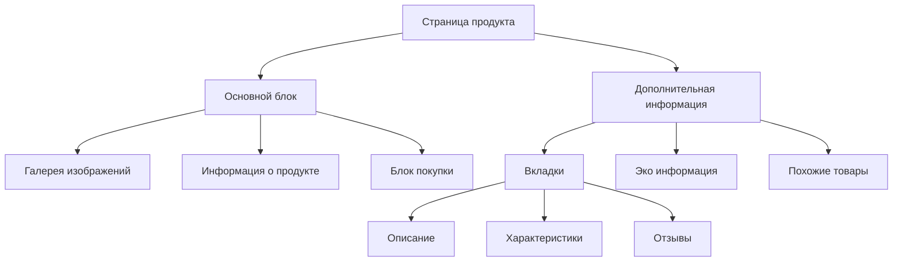

# Архитектура страницы продукта

## Текущие проблемы

1. **UI/UX проблемы:**
   - Сложная навигация на мобильных устройствах
   - Неоптимальное расположение ключевой информации
   - Отсутствие быстрого доступа к важным функциям
   - Недостаточная визуальная иерархия

2. **Технические проблемы:**
   - Сложная вложенная структура компонентов
   - Дублирование кода
   - Неоптимальная загрузка изображений
   - Отсутствие разделения на переиспользуемые компоненты

## Предлагаемые изменения

### 1. Новая структура страницы



### 2. Blade-компоненты

#### Основные компоненты:
- `x-product.gallery` - галерея изображений с зумом
- `x-product.info` - основная информация о продукте
- `x-product.purchase` - блок с ценой и кнопками действий
- `x-product.tabs` - вкладки с информацией
- `x-product.eco-features` - экологические характеристики
- `x-product.related` - похожие товары
- `x-product.reviews` - секция отзывов

### 3. Улучшения UI/UX

#### Мобильная версия:
- Sticky header с основной информацией
- Кнопка быстрой покупки всегда видна
- Оптимизированная галерея для тач-устройств
- Компактное отображение характеристик

#### Десктоп версия:
- Sticky sidebar с блоком покупки
- Расширенная галерея с зумом
- Быстрый предпросмотр характеристик
- Улучшенная навигация по вкладкам

### 4. Технические улучшения

#### Оптимизация производительности:
- Ленивая загрузка изображений через native loading="lazy"
- Прогрессивная загрузка галереи
- Кэширование данных о продукте
- Оптимизация загрузки отзывов через AJAX

#### Рефакторинг кода:
- Выделение переиспользуемых Blade-компонентов
- Оптимизация логики контроллера
- Внедрение модульного JavaScript
- Улучшение организации стилей через TailwindCSS

### 5. Новые функции

#### Для пользователей:
- Быстрый просмотр характеристик
- Сравнение с другими товарами
- Отслеживание цены
- Социальные функции (шаринг, лайки)

#### Для администраторов:
- Улучшенное управление контентом
- Аналитика просмотров
- A/B тестирование элементов
- Гибкая настройка отображения

## План внедрения

### Этап 1: Подготовка
1. Создание Blade-компонентов
2. Настройка сборки и оптимизации
3. Подготовка миграций данных

### Этап 2: Разработка
1. Реализация основных компонентов
2. Интеграция JavaScript модулей
3. Тестирование производительности

### Этап 3: Развертывание
1. Поэтапное внедрение изменений
2. Мониторинг метрик
3. Сбор обратной связи

## Технические требования

### Frontend:
- Blade-компоненты
- Vanilla JavaScript модули
- TailwindCSS
- Alpine.js для интерактивности

### Backend:
- Laravel API endpoints
- Кэширование Redis
- Оптимизация запросов
- Масштабируемая структура

## Метрики успеха

1. Улучшение времени загрузки на 50%
2. Увеличение конверсии на 20%
3. Уменьшение отказов на мобильных устройствах на 30%
4. Повышение удовлетворенности пользователей

## Риски и минимизация

1. **Риск**: Снижение производительности при большом количестве данных
   - *Решение*: Внедрение кэширования и оптимизация запросов

2. **Риск**: Сложности с адаптацией пользователей
   - *Решение*: Поэтапное внедрение и обучающие материалы

3. **Риск**: Технические сложности при интеграции
   - *Решение*: Тщательное тестирование и план отката

## Примеры компонентов

### Галерея изображений
```php
<!-- resources/views/components/product/gallery.blade.php -->
@props(['images', 'mainImage'])

<div class="product-gallery" x-data="{ activeImage: '{{ $mainImage }}' }">
    <div class="main-image">
        
    </div>
    <div class="thumbnails">
        @foreach($images as $image)
            <button @click="activeImage = '{{ $image->url }}'" 
                    class="thumbnail-btn">
                thumbnail }}" alt="{{ $image->alt }}" />
            </button>
        @endforeach
    </div>
</div>
```

### Блок покупки
```php
<!-- resources/views/components/product/purchase.blade.php -->
@props(['product'])

<div class="purchase-block" x-data="{ quantity: 1 }">
    <div class="price-block">
        @if($product->sale_price)
            <span class="sale-price">{{ $product->sale_price }}</span>
            <span class="old-price">{{ $product->price }}</span>
        @else
            <span class="regular-price">{{ $product->price }}</span>
        @endif
    </div>
    
    <div class="quantity-selector">
        <button @click="quantity--" :disabled="quantity <= 1">-</button>
        <input type="number" x-model="quantity" min="1" />
        <button @click="quantity++">+</button>
    </div>
    
    <button class="add-to-cart-btn" 
            @click="addToCart({{ $product->id }}, quantity)">
        Добавить в корзину
    </button>
</div>
```

## Заключение

Предложенная архитектура значительно улучшит пользовательский опыт и упростит поддержку кода. Использование Blade-компонентов и модульного JavaScript обеспечит высокую производительность и удобство разработки.