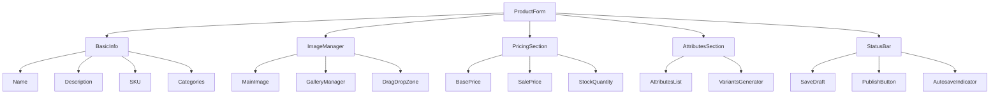

# Архитектура страницы создания товара

## 1. Структура компонентов



## 2. Схема данных

```prisma
// Расширение существующей модели Product
model Product {
  id              Int           @id @default(autoincrement())
  name            String
  slug            String        @unique
  description     String
  shortDescription String?
  sku             String        @unique
  price           Decimal
  salePrice       Decimal?
  stockQuantity   Int          @default(0)
  status          ProductStatus @default(DRAFT)
  isActive        Boolean       @default(true)
  isFeatured      Boolean       @default(false)
  isNew           Boolean       @default(false)
  
  // Связи
  images          ProductImage[]
  categories      Category[]
  attributes      ProductAttribute[]
  variants        Variant[]
  
  // Метаданные
  createdAt       DateTime      @default(now())
  updatedAt       DateTime      @updatedAt
  lastDraftSavedAt DateTime?
}

enum ProductStatus {
  DRAFT
  PUBLISHED
  ARCHIVED
}

model ProductImage {
  id        Int      @id @default(autoincrement())
  productId Int
  url       String
  alt       String?
  isPrimary Boolean  @default(false)
  sortOrder Int      @default(0)
  
  product   Product  @relation(fields: [productId], references: [id])
}

model Attribute {
  id          Int      @id @default(autoincrement())
  name        String
  type        AttributeType
  unit        String?  // Для числовых атрибутов (например, "см", "кг")
  isVariant   Boolean  @default(false) // Используется ли для создания вариантов
  options     Json?    // Предопределенные значения для select-типа
  validation  Json?    // Правила валидации (мин/макс для чисел, паттерн для строк)
  
  products    ProductAttribute[]
  variants    VariantAttribute[]
}

enum AttributeType {
  TEXT      // Текстовое поле
  NUMBER    // Числовое поле
  SELECT    // Выбор из списка
  MULTI_SELECT // Множественный выбор
}

model ProductAttribute {
  id          Int     @id @default(autoincrement())
  productId   Int
  attributeId Int
  value       Json    // Значение атрибута (строка, число или массив)
  
  product     Product   @relation(fields: [productId], references: [id])
  attribute   Attribute @relation(fields: [attributeId], references: [id])
}

model VariantAttribute {
  id          Int     @id @default(autoincrement())
  variantId   Int
  attributeId Int
  value       Json    // Значение атрибута для варианта
  
  variant     Variant   @relation(fields: [variantId], references: [id])
  attribute   Attribute @relation(fields: [attributeId], references: [id])
}
```

## 3. Server Actions

### Основные серверные действия

```typescript
// app/actions/products.ts

export async function createProduct(data: ProductFormData) {
  // Создание продукта
}

export async function updateProduct(id: string, data: ProductFormData) {
  // Обновление продукта
}

export async function saveDraft(id: string, data: ProductFormData) {
  // Сохранение черновика
}

export async function publishProduct(id: string) {
  // Публикация продукта
}

export async function archiveProduct(id: string) {
  // Архивация продукта
}
```

### Действия для работы с изображениями

```typescript
// app/actions/product-images.ts

export async function uploadImage(file: File) {
  // Загрузка изображения
}

export async function updateImageOrder(images: ImageOrderData[]) {
  // Обновление порядка изображений
}

export async function deleteImage(imageId: string) {
  // Удаление изображения
}
```

## 4. Стратегия автосохранения

### Механизм сохранения

1. Автоматическое сохранение каждые 5 минут при наличии изменений
2. Ручное сохранение через кнопку "Сохранить черновик"
3. Предупреждение при попытке закрыть страницу с несохраненными изменениями

### Компонент StatusBar

```typescript
// components/ProductForm/StatusBar.tsx
interface StatusBarProps {
  status: 'draft' | 'published' | 'archived';
  lastSavedAt: Date | null;
  isDirty: boolean;
  isSaving: boolean;
  onSaveDraft: () => Promise<void>;
  onPublish: () => Promise<void>;
}

const StatusBar: React.FC<StatusBarProps> = ({
  status,
  lastSavedAt,
  isDirty,
  isSaving,
  onSaveDraft,
  onPublish
}) => {
  return (
    <div className="status-bar">
      <div className="status-indicator">
        <StatusIcon status={status} />
        <span>{getStatusText(status)}</span>
      </div>
      
      <div className="save-section">
        {isDirty && (
          <span className="text-warning">
            Есть несохраненные изменения
          </span>
        )}
        {lastSavedAt && (
          <span className="text-muted">
            Последнее сохранение: {formatDate(lastSavedAt)}
          </span>
        )}
        <Button
          onClick={onSaveDraft}
          disabled={!isDirty || isSaving}
          loading={isSaving}
        >
          {isSaving ? 'Сохранение...' : 'Сохранить черновик'}
        </Button>
      </div>

      <div className="actions">
        <Button
          variant="primary"
          onClick={onPublish}
          disabled={isDirty || status === 'published'}
        >
          {status === 'published' ? 'Опубликован' : 'Опубликовать'}
        </Button>
      </div>
    </div>
  );
};
```

### Хук автосохранения

```typescript
// hooks/useAutosave.ts
interface AutosaveOptions {
  initialData: any;
  onSave: (data: any) => Promise<void>;
  interval?: number;
}

export function useAutosave({
  initialData,
  onSave,
  interval = 300000, // 5 минут
}: AutosaveOptions) {
  const [data, setData] = useState(initialData);
  const [isSaving, setIsSaving] = useState(false);
  const [lastSavedAt, setLastSavedAt] = useState<Date | null>(null);
  const [isDirty, setIsDirty] = useState(false);

  // Автоматическое сохранение по таймеру
  useEffect(() => {
    if (!isDirty) return;

    const timer = setInterval(async () => {
      await handleSave();
    }, interval);

    return () => clearInterval(timer);
  }, [isDirty, data]);

  // Предупреждение при закрытии страницы
  useEffect(() => {
    const handleBeforeUnload = (e: BeforeUnloadEvent) => {
      if (isDirty) {
        e.preventDefault();
        e.returnValue = '';
      }
    };

    window.addEventListener('beforeunload', handleBeforeUnload);
    return () => window.removeEventListener('beforeunload', handleBeforeUnload);
  }, [isDirty]);

  // Функция сохранения
  const handleSave = async () => {
    if (!isDirty || isSaving) return;

    setIsSaving(true);
    try {
      await onSave(data);
      setLastSavedAt(new Date());
      setIsDirty(false);
    } catch (error) {
      console.error('Ошибка при сохранении:', error);
    } finally {
      setIsSaving(false);
    }
  };

  return {
    data,
    setData,
    isSaving,
    lastSavedAt,
    isDirty,
    save: handleSave
  };
}
```

## 5. Загрузка и оптимизация изображений

### Ограничения и требования

1. Лимиты и форматы:
   - Максимум 8 изображений (включая главное)
   - Поддерживаемые форматы: JPG, PNG, GIF
   - Максимальный размер файла: 10MB
   - Обязательное наличие главного изображения

2. Функциональность:
   - Drag & drop для загрузки файлов
   - Drag & drop для сортировки изображений
   - Выбор главного изображения
   - Добавление alt-текста для SEO
   - Предпросмотр перед загрузкой

3. Размеры и оптимизация:
   ```typescript
   interface ImageSizes {
     thumbnail: string; // 150x150, cover
     preview: string;   // 300x300, contain
     medium: string;    // 800x800, contain
     large: string;     // 1500x1500, contain
     original: string;  // оригинал с оптимизацией
   }
   ```

### Компоненты управления изображениями

```typescript
// components/ProductForm/ImageManager/types.ts
interface ImageFile {
  id: string;
  file: File;
  preview: string;
  status: 'uploading' | 'success' | 'error';
  progress: number;
  error?: string;
}

interface ProductImage {
  id: string;
  url: string;
  alt: string;
  isPrimary: boolean;
  sizes: ImageSizes;
}

// components/ProductForm/ImageManager/ImageUploader.tsx
interface ImageUploaderProps {
  images: ProductImage[];
  maxImages: number;
  onFilesSelected: (files: File[]) => void;
  onError: (error: string) => void;
}

const allowedTypes = ['image/jpeg', 'image/png', 'image/gif'];
const maxSize = 10 * 1024 * 1024; // 10MB

// components/ProductForm/ImageManager/ImageGrid.tsx
interface ImageGridProps {
  images: ProductImage[];
  onReorder: (newOrder: string[]) => void;
  onPrimaryChange: (imageId: string) => void;
  onDelete: (imageId: string) => void;
  onAltChange: (imageId: string, alt: string) => void;
}
```

### Процесс обработки изображений

```typescript
// lib/image-processing.ts
class ImageProcessor {
  private async validateFile(file: File): Promise<void> {
    if (!allowedTypes.includes(file.type)) {
      throw new Error('Неподдерживаемый формат файла. Разрешены JPG, PNG и GIF');
    }
    
    if (file.size > maxSize) {
      throw new Error('Размер файла превышает 10MB');
    }
  }

  async processImage(file: File): Promise<ImageSizes> {
    await this.validateFile(file);
    
    const sharp = require('sharp');
    const buffer = await file.arrayBuffer();
    
    // Создаем все размеры параллельно
    const [thumbnail, preview, medium, large, optimizedOriginal] = await Promise.all([
      this.createThumbnail(buffer),
      this.createPreview(buffer),
      this.createMedium(buffer),
      this.createLarge(buffer),
      this.optimizeOriginal(buffer)
    ]);

    return {
      thumbnail: await this.uploadToStorage(thumbnail, 'thumbnail'),
      preview: await this.uploadToStorage(preview, 'preview'),
      medium: await this.uploadToStorage(medium, 'medium'),
      large: await this.uploadToStorage(large, 'large'),
      original: await this.uploadToStorage(optimizedOriginal, 'original')
    };
  }

  private async createThumbnail(buffer: ArrayBuffer) {
    return sharp(buffer)
      .resize(150, 150, { fit: 'cover' })
      .jpeg({ quality: 80 });
  }

  private async createPreview(buffer: ArrayBuffer) {
    return sharp(buffer)
      .resize(300, 300, { fit: 'contain', background: { r: 255, g: 255, b: 255, alpha: 0 } })
      .jpeg({ quality: 85 });
  }

  // ... аналогичные методы для других размеров
}
```

### Хук управления изображениями

```typescript
// hooks/useProductImages.ts
export function useProductImages(options: {
  maxImages: number;
  initialImages?: ProductImage[];
  onImagesChange: (images: ProductImage[]) => void;
}) {
  // ... реализация хука управления изображениями
}
```

## 8. Управление атрибутами и вариантами

### Компоненты атрибутов

```typescript
// components/ProductForm/Attributes/types.ts
interface AttributeDefinition {
  id: number;
  name: string;
  type: 'TEXT' | 'NUMBER' | 'SELECT' | 'MULTI_SELECT';
  unit?: string;
  isVariant: boolean;
  options?: string[];
  validation?: {
    min?: number;
    max?: number;
    pattern?: string;
    required?: boolean;
  };
}

interface AttributeValue {
  attributeId: number;
  value: string | number | string[];
}

// components/ProductForm/Attributes/AttributeEditor.tsx
interface AttributeEditorProps {
  attribute: AttributeDefinition;
  value: AttributeValue | undefined;
  onChange: (value: AttributeValue) => void;
  error?: string;
}

// components/ProductForm/Attributes/AttributesList.tsx
interface AttributesListProps {
  attributes: AttributeDefinition[];
  values: Record<number, AttributeValue>;
  onChange: (attributeId: number, value: AttributeValue) => void;
  errors?: Record<number, string>;
}
```

### Компоненты вариантов

```typescript
// components/ProductForm/Variants/types.ts
interface VariantDefinition {
  id?: number;
  sku: string;
  price: number;
  salePrice?: number;
  stockQuantity: number;
  attributes: AttributeValue[];
}

// components/ProductForm/Variants/VariantGenerator.tsx
interface VariantGeneratorProps {
  variantAttributes: AttributeDefinition[]; // Атрибуты с isVariant = true
  basePrice: number;
  baseSku: string;
  onGenerate: (variants: VariantDefinition[]) => void;
}

// components/ProductForm/Variants/VariantsList.tsx
interface VariantsListProps {
  variants: VariantDefinition[];
  attributes: AttributeDefinition[];
  onChange: (variants: VariantDefinition[]) => void;
  onDelete: (variantId: number) => void;
}
```

### Хук управления вариантами

```typescript
// hooks/useProductVariants.ts
export function useProductVariants({
  variantAttributes,
  initialVariants = [],
  onChange,
  basePrice,
  baseSku
}: {
  variantAttributes: AttributeDefinition[];
  initialVariants?: VariantDefinition[];
  onChange: (variants: VariantDefinition[]) => void;
  basePrice: number;
  baseSku: string;
}) {
  const [variants, setVariants] = useState<VariantDefinition[]>(initialVariants);

  // Генерация всех возможных комбинаций вариантов
  const generateVariants = useCallback(() => {
    const combinations = generateAttributeCombinations(variantAttributes);
    const newVariants = combinations.map((combo, index) => ({
      sku: `${baseSku}-${index + 1}`,
      price: basePrice,
      stockQuantity: 0,
      attributes: combo
    }));
    setVariants(newVariants);
    onChange(newVariants);
  }, [variantAttributes, basePrice, baseSku]);

  // Обновление отдельного варианта
  const updateVariant = useCallback((variantId: number, data: Partial<VariantDefinition>) => {
    setVariants(prev => prev.map(v =>
      v.id === variantId ? { ...v, ...data } : v
    ));
  }, []);

  // Удаление варианта
  const deleteVariant = useCallback((variantId: number) => {
    setVariants(prev => prev.filter(v => v.id !== variantId));
  }, []);

  return {
    variants,
    generateVariants,
    updateVariant,
    deleteVariant,
    hasVariants: variants.length > 0
  };
}
```
  maxImages: number;
  initialImages?: ProductImage[];
  onImagesChange: (images: ProductImage[]) => void;
}) {
  const [images, setImages] = useState<ProductImage[]>(options.initialImages ?? []);
  const [uploading, setUploading] = useState<ImageFile[]>([]);

  const handleFilesSelected = async (files: File[]) => {
    if (images.length + files.length > options.maxImages) {
      throw new Error(`Максимальное количество изображений: ${options.maxImages}`);
    }

    const processor = new ImageProcessor();
    const newUploading = files.map(file => ({
      id: nanoid(),
      file,
      preview: URL.createObjectURL(file),
      status: 'uploading' as const,
      progress: 0
    }));

    setUploading(prev => [...prev, ...newUploading]);

    try {
      const processed = await Promise.all(
        files.map(async file => {
          const sizes = await processor.processImage(file);
          return {
            id: nanoid(),
            url: sizes.original,
            alt: '',
            isPrimary: images.length === 0, // Первое изображение становится главным
            sizes
          };
        })
      );

      setImages(prev => [...prev, ...processed]);
      options.onImagesChange([...images, ...processed]);
    } catch (error) {
      console.error('Ошибка обработки изображений:', error);
    }
  };

  // ... остальные методы управления изображениями
}
```

## 6. Валидация

### Клиентская валидация

```typescript
// schemas/product.ts

export const productSchema = z.object({
  name: z.string().min(3).max(100).trim(),
  description: z.string().min(10).max(5000).trim(),
  sku: z.string().regex(/^[A-Za-z0-9-]+$/).min(4).max(50),
  price: z.number().positive().multipleOf(0.01).max(999999.99),
  salePrice: z.number().positive().multipleOf(0.01).max(999999.99)
    .optional()
    .refine(val => !val || val < this.price, {
      message: "Акционная цена должна быть ниже основной цены"
    }),
  stockQuantity: z.number().int().min(0),
  categoryIds: z.array(z.number()).min(1, "Выберите хотя бы одну категорию"),
  status: z.enum(["DRAFT", "PUBLISHED", "ARCHIVED"]),
  isActive: z.boolean(),
  isFeatured: z.boolean(),
  isNew: z.boolean(),
  
  // Валидация изображений
  mainImage: z.object({
    id: z.string(),
    url: z.string().url(),
    alt: z.string().optional()
  }).required(),
  additionalImages: z.array(z.object({
    id: z.string(),
    url: z.string().url(),
    alt: z.string().optional()
  })),

  // Валидация атрибутов
  attributes: z.array(z.object({
    attributeId: z.number(),
    values: z.array(z.string())
  })),

  // Валидация вариантов
  variants: z.array(z.object({
    sku: z.string().regex(/^[A-Za-z0-9-]+$/).min(4).max(50),
    price: z.number().positive().multipleOf(0.01).max(999999.99),
    salePrice: z.number().positive().multipleOf(0.01).max(999999.99)
      .optional()
      .refine(val => !val || val < this.price, {
        message: "Акционная цена варианта должна быть ниже основной цены"
      }),
    stockQuantity: z.number().int().min(0),
    attributeValues: z.array(z.number()).min(1)
  })).optional()
});
```

### Серверная валидация

- Проверка уникальности SKU
- Валидация загружаемых файлов
- Проверка корректности связей (категории, атрибуты)

## 7. Компоненты UI

```typescript
// components/ProductForm/BasicInfo.tsx
interface BasicInfoProps {
  initialData?: ProductData;
  onUpdate: (data: Partial<ProductData>) => void;
}

// components/ProductForm/ImageManager.tsx
interface ImageManagerProps {
  images: ProductImage[];
  onUpload: (files: File[]) => Promise<void>;
  onReorder: (newOrder: string[]) => void;
  onDelete: (imageId: string) => void;
}

// components/ProductForm/StatusBar.tsx
interface StatusBarProps {
  status: 'draft' | 'published' | 'archived';
  lastSaved?: Date;
  isDirty: boolean;
  onPublish: () => void;
  onSaveDraft: () => void;
  onArchive: () => void;
}